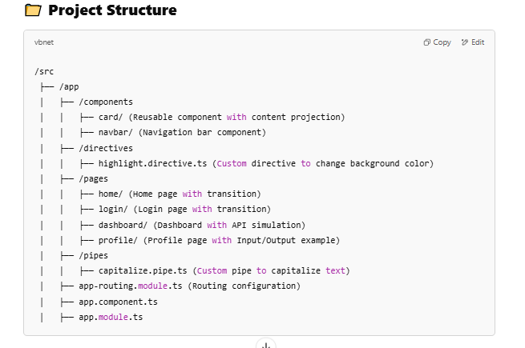

📌 Features and Implementation
1️⃣ Content Projection (Card Component)
📌 What is it?
Content projection allows you to pass HTML inside a reusable component.

📌 How to Implement?
1️⃣ Create a Card Component

sh
Copy
Edit
ng generate component components/card
2️⃣ Modify card.component.html

html
Copy
Edit

  

    <ng-content></ng-content> <!-- Content Projection -->
  

3️⃣ Add styles in card.component.css

css
Copy
Edit
.card {
  border: 1px solid #ddd;
  border-radius: 5px;
  padding: 10px;
  box-shadow: 2px 2px 10px rgba(0, 0, 0, 0.1);
}
4️⃣ Use it in HomeComponent

html
Copy
Edit
<app-card>
  <h3>Welcome to My App</h3>
  
This is a reusable card component.

</app-card>
2️⃣ Custom Directive (HighlightDirective)
📌 What is it?
A directive modifies the behavior of an element.

📌 How to Implement?
1️⃣ Generate a directive

sh
Copy
Edit
ng generate directive directives/highlight
2️⃣ Modify highlight.directive.ts

ts
Copy
Edit
import { Directive, ElementRef, HostListener } from '@angular/core';

@Directive({
  selector: '[appHighlight]'
})
export class HighlightDirective {
  constructor(private el: ElementRef) {}

  @HostListener('mouseenter') onMouseEnter() {
    this.el.nativeElement.style.backgroundColor = 'yellow';
  }

  @HostListener('mouseleave') onMouseLeave() {
    this.el.nativeElement.style.backgroundColor = 'transparent';
  }
}
3️⃣ Use it in DashboardComponent

html
Copy
Edit

Hover over me to see the directive in action!

3️⃣ Lifecycle Hooks (ngOnInit, ngOnDestroy)
📌 What is it?
Lifecycle hooks let you run code at different stages of a component's life.

📌 How to Implement?
Modify dashboard.component.ts

ts
Copy
Edit
import { Component, OnInit, OnDestroy } from '@angular/core';

@Component({
  selector: 'app-dashboard',
  templateUrl: './dashboard.component.html'
})
export class DashboardComponent implements OnInit, OnDestroy {
  users: any[] = [];

  ngOnInit() {
    console.log('Dashboard Component Initialized');
    this.fetchUsers();
  }

  fetchUsers() {
    setTimeout(() => {
      this.users = [
        { name: 'John Doe', age: 30 },
        { name: 'Jane Smith', age: 25 }
      ];
    }, 2000);
  }

  ngOnDestroy() {
    console.log('Dashboard Component Destroyed');
  }
}
4️⃣ Custom Pipe (CapitalizePipe)
📌 What is it?
A custom pipe transforms data.

📌 How to Implement?
1️⃣ Generate a Pipe

sh
Copy
Edit
ng generate pipe pipes/capitalize
2️⃣ Modify capitalize.pipe.ts

ts
Copy
Edit
import { Pipe, PipeTransform } from '@angular/core';

@Pipe({
  name: 'capitalize'
})
export class CapitalizePipe implements PipeTransform {
  transform(value: string): string {
    return value.replace(/\b\w/g, char => char.toUpperCase());
  }
}
3️⃣ Use it in ProfileComponent

html
Copy
Edit

{{ 'hello world' | capitalize }}

5️⃣ Routing & Page Transitions
📌 What is it?
Angular routing allows navigation between pages, and we’ll add smooth transitions.

📌 How to Implement?
1️⃣ Modify app-routing.module.ts

ts
Copy
Edit
import { NgModule } from '@angular/core';
import { RouterModule, Routes } from '@angular/router';
import { HomeComponent } from './pages/home/home.component';
import { LoginComponent } from './pages/login/login.component';
import { DashboardComponent } from './pages/dashboard/dashboard.component';

const routes: Routes = [
  { path: '', component: HomeComponent },
  { path: 'login', component: LoginComponent },
  { path: 'dashboard', component: DashboardComponent }
];

@NgModule({
  imports: [RouterModule.forRoot(routes)],
  exports: [RouterModule]
})
export class AppRoutingModule {}
2️⃣ Add transitions in styles.css

css
Copy
Edit
/* Fade-in effect for pages */
.page {
  opacity: 0;
  transform: translateY(-10px);
  animation: fadeIn 0.5s forwards;
}

@keyframes fadeIn {
  to {
    opacity: 1;
    transform: translateY(0);
  }
}
3️⃣ Apply to components

html
Copy
Edit

  <h1>Home Page</h1>

6️⃣ Parent-Child Communication (Input/Output)
📌 What is it?
@Input() passes data from parent to child.
@Output() emits events from child to parent.

📌 How to Implement?
1️⃣ Modify profile.component.ts

ts
Copy
Edit
import { Component, Input, Output, EventEmitter } from '@angular/core';

@Component({
  selector: 'app-profile',
  templateUrl: './profile.component.html'
})
export class ProfileComponent {
  @Input() user: any;
  @Output() logout = new EventEmitter<void>();

  onLogout() {
    this.logout.emit();
  }
}
2️⃣ Use it in dashboard.component.html

html
Copy
Edit
<app-profile [user]="users[0]" (logout)="handleLogout()"></app-profile>
🚀 Run the Project
1️⃣ Install Angular CLI

sh
Copy
Edit
npm install -g @angular/cli
2️⃣ Create and run the project

sh
Copy
Edit
ng new angular-practice
cd angular-practice
ng serve
